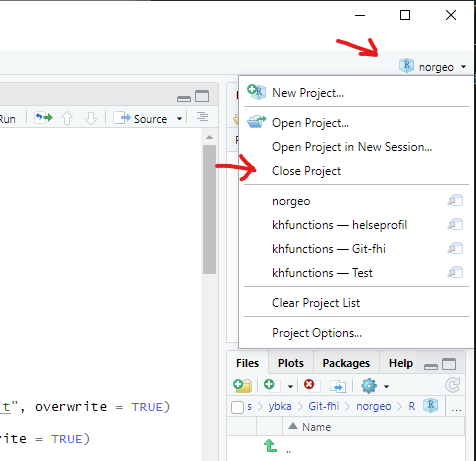

# Hvordan installere.

De tre hovedpakkene i produksjonsapparatet er `orgdata` (aggregering av originalfiler), `khfunctions` (lager filgrupper og kuber) og `khvalitetskontroll`. For å installere disse, kjør kodene som beskrevet under. 

For å installere pakkene må du først installere  **Git** fra Firmaportalen, og sette denne opp i RStudio (Global options).

Før installering, sjekk at du ikke er i et prosjekt. Ellers må du først stenge prosjektet ie. `Close Project`.
<p align="left"></p>

## KHfunctions
- For å installere khfunctions, kjør følgende kode:

```R
source("https://raw.githubusercontent.com/helseprofil/misc/main/utils.R")
kh_install(khfunctions)

# Eller
kh_install(khfunctions, path = "C:/Min/Favoritt/Path")
```
- Standard path blir `C:/Users/DittBrukernavn/helseprofil` hvis argument `path` ikke er spesifisert.
- RStudio skal restarte når alle tillegg pakkene har blitt installert og så re-åpne innen *khfunctions* prosjekt.
For å synkronisere alle pakkeversjoner som brukes i *KHfunctions*, kjør:

```R
renv::restore()
```

## orgdata
- For å installere orgdata, kjør følgende kode:

```R
source("https://raw.githubusercontent.com/helseprofil/misc/main/utils.R")
kh_install(orgdata)
```
- Du får automatisk beskjed i konsollen ved pakke *loading* når det kommer ny versjon. For å oppdatere til ny versjon manuelt, kjør:

```R
orgdata::update_orgdata()
```
- For mer detaljert veiledning kan leses [her](https://helseprofil.github.io/orgdata "orgdata")

## KHvalitetskontroll
- For å installere khvaliteskontroll, kjør følgende kode: 

```R
source("https://raw.githubusercontent.com/helseprofil/misc/main/utils.R")
kh_install(KHvalitetskontroll)

# Eller
kh_install(KHvalitetskontroll, path = "C:/in/Favoritt/Path")
```
